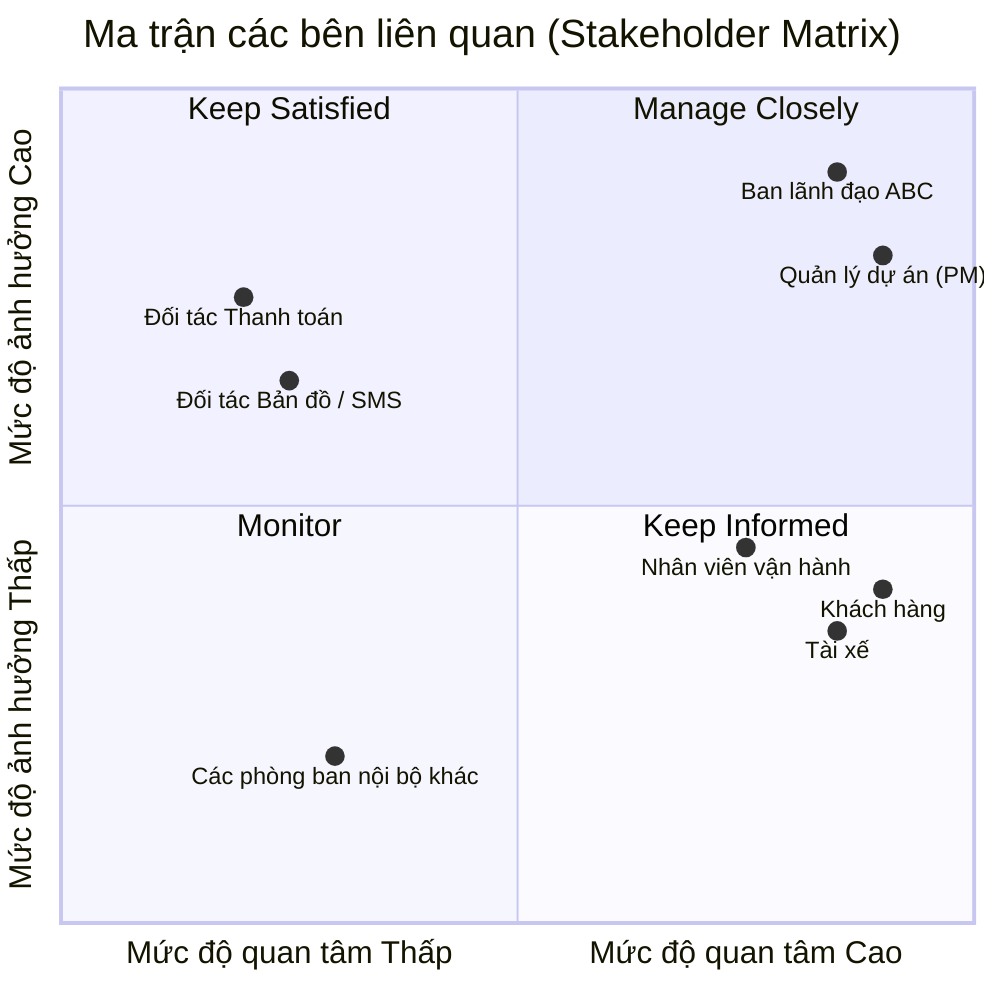

Dưới đây là tài liệu phân tích chi tiết các Stakeholder và các Quy tắc nghiệp vụ (Business Rules) của dự án CAB System, được trình bày theo định dạng Markdown.

## 1. Phân tích các bên liên quan (Stakeholder Analysis)

### Danh sách Stakeholder

| Nhóm Stakeholder | Vai trò trong dự án | Mối quan tâm / Kỳ vọng chính |
| --- | --- | --- |
| **Ban lãnh đạo công ty ABC** | Nhà tài trợ (Sponsor) / Ra quyết định | Thời gian triển khai đúng **7 tuần**; tự động hóa quy trình; hệ thống chịu tải tốt, không gián đoạn; khả năng mở rộng dịch vụ tương lai; có báo cáo doanh thu & hiệu suất đầy đủ. |
| **Khách hàng (Customer)** | Người dùng cuối (Người đặt xe) | Ứng dụng dễ dùng; dễ dàng đặt xe, theo dõi tài xế và xem ETA (thời gian dự kiến đến); thanh toán an toàn, đa dạng phương thức; nhận thông báo rõ ràng trong mọi tình huống. |
| **Tài xế (Driver)** | Người dùng cuối (Người cung cấp dịch vụ) | Nhận cuốc xe công bằng (gần nhất/phù hợp nhất); ứng dụng dễ thao tác khi đang lái xe; nhận thông báo chuyến mới nhanh chóng; theo dõi được thu nhập. |
| **Nhân viên vận hành / Admin** | Người dùng cuối (Quản trị hệ thống) | Giao diện quản trị tập trung; công cụ hỗ trợ xử lý sự cố chuyến đi nhanh chóng; tra cứu lịch sử giao dịch dễ dàng; được phân quyền hợp lý theo chức năng. |
| **Đối tác Thanh toán (Payment Gateway)** | Hệ thống tích hợp bên ngoài | Tích hợp qua API chuẩn; hệ thống CAB không lưu thông tin thẻ nhạy cảm; xử lý các giao dịch thất bại đúng quy trình. |
| **Đối tác Bản đồ (Map/Routing API)** | Hệ thống tích hợp bên ngoài | Cung cấp dữ liệu tọa độ, tính toán quãng đường và thời gian (ETA) chính xác để phục vụ thuật toán điều phối xe. |
| **Dịch vụ Thông báo (SMS/Email/Push)** | Hệ thống tích hợp bên ngoài | Đảm bảo tốc độ gửi thông báo (OTP, trạng thái chuyến) tới người dùng nhanh và ổn định (Real-time). |
| **Đội ngũ dự án (PM, BA, Dev, QA)** | Đội ngũ thực thi | Yêu cầu nghiệp vụ rõ ràng; kiến trúc hệ thống độc lập linh hoạt; quản lý được rủi ro và phạm vi dự án trong 7 tuần. |

---

### Sơ đồ Stakeholder Matrix (Power / Interest Grid)

Sơ đồ dưới đây phân loại các bên liên quan dựa trên hai tiêu chí: **Mức độ ảnh hưởng (Power)** đối với dự án và **Mức độ quan tâm (Interest)** đến kết quả dự án.

* **Quản lý chặt chẽ (Q1):** Ban lãnh đạo ABC, Quản lý dự án – Cần thường xuyên báo cáo tiến độ, xin phê duyệt các quyết định quan trọng.
* **Giữ hài lòng (Q2):** Các Đối tác tích hợp (Thanh toán, Bản đồ) – Không tham gia vận hành hàng ngày nhưng API của họ ảnh hưởng lớn đến kiến trúc và sự sống còn của ứng dụng.
* **Giữ thông tin (Q3):** Khách hàng, Tài xế, Nhân viên vận hành – Cần thu thập ý kiến, cung cấp tài liệu hướng dẫn và thông báo khi hệ thống ra mắt.
* **Theo dõi (Q4):** Các phòng ban nội bộ khác không trực tiếp tham gia vận hành.

---

## 2. Các quy tắc nghiệp vụ (Business Rules)

Dựa trên mô tả dự án, chúng ta có thể trích xuất các quy tắc nghiệp vụ (BR) thành 2 nhóm: Nhóm quy tắc đã xác định và Nhóm quy tắc cần làm rõ thêm.

### 2.1. Các quy tắc đã được xác định rõ

**Nhóm 1: Quản lý người dùng và Xác thực (Authentication & User Management)**

* **BR_01:** Khách hàng và Tài xế bắt buộc phải đăng nhập/xác thực tài khoản trước khi sử dụng các chức năng chính (đặt xe, nhận cuốc).
* **BR_02:** Tài khoản Tài xế có thể tự đăng ký trên ứng dụng HOẶC được nhân viên vận hành tạo từ hệ thống quản trị.
* **BR_03:** Chỉ khi đang ở trạng thái "Làm việc", Tài xế mới có thể bật trạng thái "Sẵn sàng nhận chuyến".

**Nhóm 2: Điều phối và Xử lý chuyến đi (Dispatching & Trip Execution)**

* **BR_04:** Việc tìm tài xế phải dựa trên vị trí gần khách hàng nhất, loại xe phù hợp và trạng thái sẵn sàng của tài xế.
* **BR_05:** Nếu tài xế đầu tiên được đề xuất không phản hồi hoặc từ chối, hệ thống phải **tự động** chuyển yêu cầu cho tài xế phù hợp tiếp theo mà không yêu cầu khách hàng thao tác lại.
* **BR_06:** Nếu quét qua toàn bộ tài xế khả dụng mà không có ai nhận chuyến, hệ thống phải gửi thông báo rõ ràng cho khách hàng (không để khách hàng chờ vô tận).
* **BR_07:** Hành trình của một chuyến đi chuẩn phải đi qua các trạng thái: Đã tiếp nhận yêu cầu -> Đang tìm tài xế -> Tài xế nhận chuyến -> Tài xế đến điểm đón -> Đã đón khách -> Đang di chuyển -> Hoàn thành.

**Nhóm 3: Thanh toán và Tính cước (Pricing & Payment)**

* **BR_08:** Tiền cước được tính dựa trên loại dịch vụ (loại xe) và thông tin chuyến đi (quãng đường, thời gian).
* **BR_09:** **[Cực kỳ quan trọng]** Hệ thống CAB không được phép lưu trữ trực tiếp các thông tin nhạy cảm của thẻ tín dụng/tài khoản thanh toán của khách hàng.
* **BR_10:** Nếu giao dịch thanh toán điện tử thất bại, hệ thống không được hủy chuyến ngay mà phải thông báo cho khách hàng và cho phép thao tác thanh toán lại.

**Nhóm 4: Quản trị và Kiến trúc hệ thống (Admin & NFR Rules)**

* **BR_11:** Giao diện quản trị phải áp dụng cơ chế Phân quyền (Role-Based Access Control). Nhân viên thông thường không được thực hiện các thao tác nhạy cảm (ví dụ: hoàn tiền, khóa tài khoản vô thời hạn).
* **BR_12:** Mọi thao tác quản trị quan trọng đều phải được lưu vết (Audit Log) để phục vụ tra soát.
* **BR_13:** Lỗi ở module thanh toán hoặc module thông báo không được làm sập tính năng đặt xe cốt lõi (Yêu cầu kiến trúc độc lập).

---

## 3. Yêu cầu Nghiệp vụ (Business Requirements)

###  Nhóm Tự động hóa & Tối ưu vận hành (Operational Efficiency)

Mục tiêu cốt lõi của dự án là loại bỏ sự phụ thuộc vào sức người trong việc điều phối xe hiện tại.

* **BRQ_01 - Tự động hóa toàn trình (End-to-end Automation):** Hệ thống phải tự động hóa hoàn toàn quy trình đặt xe, từ lúc khách hàng gửi yêu cầu, thuật toán tự động tìm và phân công tài xế, cho đến khi hoàn thành chuyến đi và tính cước, mà không cần sự can thiệp thủ công của nhân viên tổng đài.
* **BRQ_02 - Xử lý điều phối thông minh:** Hệ thống phải có khả năng tự động xử lý các tình huống từ chối cuốc hoặc không phản hồi từ tài xế bằng cách liên tục chuyển hướng yêu cầu (re-routing) đến các tài xế phù hợp khác, đảm bảo tỷ lệ khớp lệnh (match rate) cao nhất.

###  Nhóm Nâng cao Trải nghiệm Người dùng (User Experience Enhancement)

* **BRQ_03 - Tính minh bạch theo thời gian thực (Real-time Visibility):** Hệ thống phải cung cấp thông tin theo thời gian thực về vị trí tài xế, trạng thái chuyến đi và thời gian dự kiến đến (ETA) cho khách hàng, giúp giảm thiểu sự lo lắng và các cuộc gọi khiếu nại lên tổng đài.
* **BRQ_04 - Đa dạng hóa phương thức thanh toán:** Nền tảng phải hỗ trợ linh hoạt cả thanh toán tiền mặt và thanh toán điện tử không tiền mặt, mang lại sự tiện lợi tối đa cho khách hàng mà vẫn đảm bảo an toàn luồng tiền cho doanh nghiệp.

###  Nhóm Quản trị tập trung & Ra quyết định (Centralized Management & Data-driven)

* **BRQ_05 - Quản lý vận hành tập trung:** Doanh nghiệp phải có một không gian làm việc duy nhất (Admin Portal) để quản lý toàn diện hồ sơ (khách hàng, tài xế, phương tiện), theo dõi trạng thái hệ thống và can thiệp hỗ trợ tức thời khi có sự cố chuyến đi.
* **BRQ_06 - Cung cấp dữ liệu báo cáo (Reporting & Analytics):** Hệ thống phải cung cấp các báo cáo thống kê chính xác về doanh thu, tỷ lệ hoàn thành/hủy chuyến, và hiệu suất làm việc của tài xế để Ban lãnh đạo có cơ sở đưa ra các quyết định kinh doanh.

###  Nhóm Kiến trúc & Mở rộng tương lai (Scalability & Future-proofing)

* **BRQ_07 - Khả năng chịu tải linh hoạt (High Scalability):** Hệ thống phải duy trì hoạt động ổn định và mượt mà trong các khung giờ cao điểm (nhu cầu tăng đột biến) mà không bị tắc nghẽn.
* **BRQ_08 - Kiến trúc độc lập (Decoupled Architecture):** Hệ thống phải được thiết kế dạng module/dịch vụ độc lập sao cho lỗi ở một tính năng phụ (như thanh toán thất bại, đối tác SMS nghẽn mạng) không làm sụp đổ tính năng lõi là Đặt xe & Nhận chuyến.
* **BRQ_09 - Khả năng mở rộng nghiệp vụ (Extensibility):** Nền tảng CAB phải có khả năng dễ dàng "plug-and-play" (tích hợp thêm) các loại hình dịch vụ mới (ví dụ: giao hàng, xe hạng sang), các cổng thanh toán mới, hoặc các đối tác thông báo mới trong tương lai mà không phải đập đi xây lại hệ thống.

---

## Tiêu chí thành công của dự án (Business Success Metrics / KPIs)

Để biết được hệ thống CAB mới khi đưa vào thực tế có đáp ứng được các Business Requirements trên hay không, Ban lãnh đạo sẽ cần đo lường bằng các chỉ số sau sau khi go-live:

1. **Thời gian triển khai:** Hoàn thành và đưa vào sử dụng (Go-live) phiên bản MVP đúng trong **7 tuần**.
2. **Tỷ lệ tự động hóa (Automation Rate):** > 95% chuyến đi được phân công và hoàn thành hoàn toàn bằng thuật toán tự động, không qua tổng đài.
3. **Tỷ lệ hoàn thành chuyến (Completion Rate):** Tăng tỷ lệ chuyến đi thành công so với hệ thống cũ nhờ thuật toán phân công thông minh hơn.
4. **Thời gian chờ trung bình (Average Wait Time / ETA):** Giảm thời gian chờ xe trung bình của khách hàng xuống dưới mức mục tiêu (ví dụ: < 5 phút ở nội thành).
5. **Thời gian hoạt động (Uptime):** Hệ thống lõi đạt uptime 99.9%, đặc biệt không sập toàn hệ thống trong giờ cao điểm.

---

