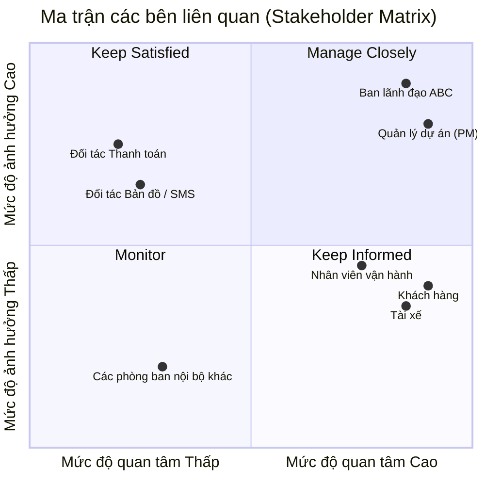
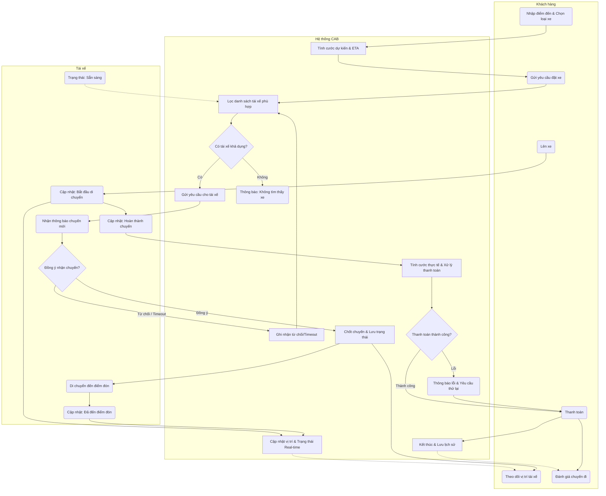
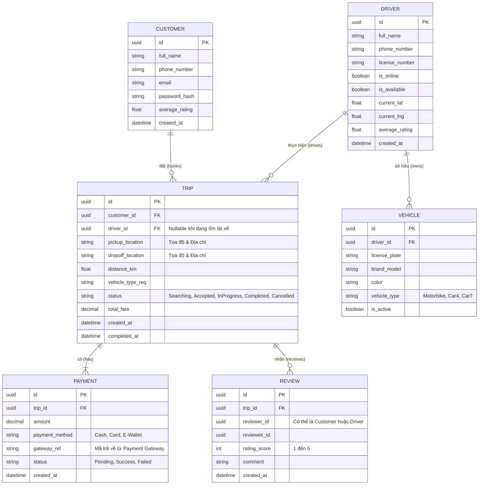
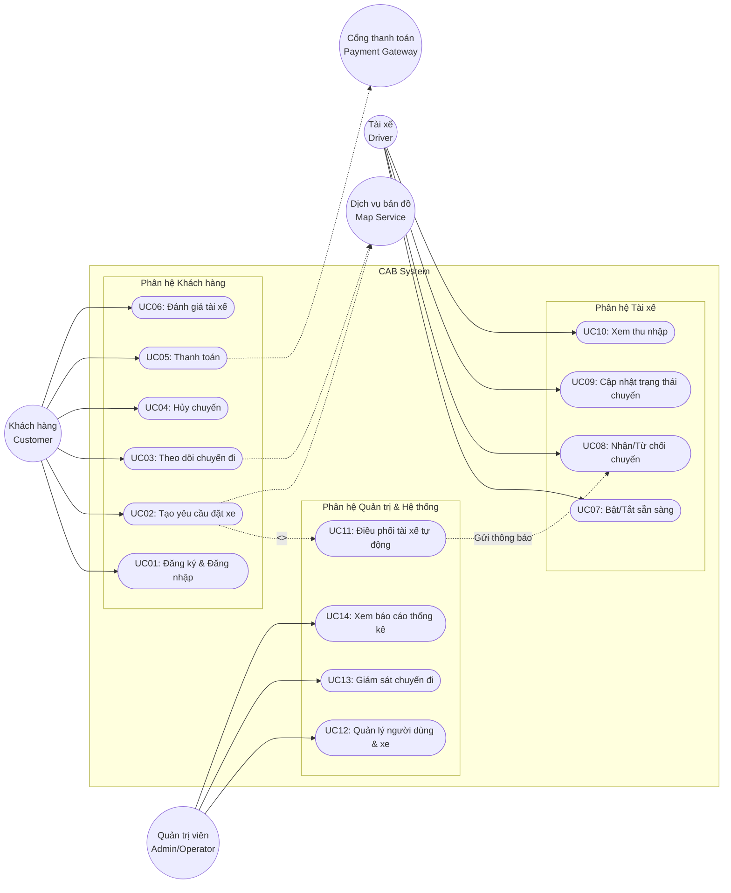

Dưới đây là tài liệu phân tích chi tiết các Stakeholder và các Quy tắc nghiệp vụ (Business Rules) của dự án CAB System, được trình bày theo định dạng Markdown.

## 1. Phân tích các bên liên quan (Stakeholder Analysis)

### Danh sách Stakeholder

| Nhóm Stakeholder | Vai trò trong dự án | Mối quan tâm / Kỳ vọng chính |
| --- | --- | --- |
| **Ban lãnh đạo công ty ABC** | Nhà tài trợ (Sponsor) / Ra quyết định | Thời gian triển khai đúng **7 tuần**; tự động hóa quy trình; hệ thống chịu tải tốt, không gián đoạn; khả năng mở rộng dịch vụ tương lai; có báo cáo doanh thu & hiệu suất đầy đủ. |
| **Khách hàng (Customer)** | Người dùng cuối (Người đặt xe) | Ứng dụng dễ dùng; dễ dàng đặt xe, theo dõi tài xế và xem ETA (thời gian dự kiến đến); thanh toán an toàn, đa dạng phương thức; nhận thông báo rõ ràng trong mọi tình huống. |
| **Tài xế (Driver)** | Người dùng cuối (Người cung cấp dịch vụ) | Nhận cuốc xe công bằng (gần nhất/phù hợp nhất); ứng dụng dễ thao tác khi đang lái xe; nhận thông báo chuyến mới nhanh chóng; theo dõi được thu nhập. |
| **Nhân viên vận hành / Admin** | Người dùng cuối (Quản trị hệ thống) | Giao diện quản trị tập trung; công cụ hỗ trợ xử lý sự cố chuyến đi nhanh chóng; tra cứu lịch sử giao dịch dễ dàng; được phân quyền hợp lý theo chức năng. |
| **Đối tác Thanh toán (Payment Gateway)** | Hệ thống tích hợp bên ngoài | Tích hợp qua API chuẩn; hệ thống CAB không lưu thông tin thẻ nhạy cảm; xử lý các giao dịch thất bại đúng quy trình. |
| **Đối tác Bản đồ (Map/Routing API)** | Hệ thống tích hợp bên ngoài | Cung cấp dữ liệu tọa độ, tính toán quãng đường và thời gian (ETA) chính xác để phục vụ thuật toán điều phối xe. |
| **Dịch vụ Thông báo (SMS/Email/Push)** | Hệ thống tích hợp bên ngoài | Đảm bảo tốc độ gửi thông báo (OTP, trạng thái chuyến) tới người dùng nhanh và ổn định (Real-time). |
| **Đội ngũ dự án (PM, BA, Dev, QA)** | Đội ngũ thực thi | Yêu cầu nghiệp vụ rõ ràng; kiến trúc hệ thống độc lập linh hoạt; quản lý được rủi ro và phạm vi dự án trong 7 tuần. |

---

### Sơ đồ Stakeholder Matrix (Power / Interest Grid)

Sơ đồ dưới đây phân loại các bên liên quan dựa trên hai tiêu chí: **Mức độ ảnh hưởng (Power)** đối với dự án và **Mức độ quan tâm (Interest)** đến kết quả dự án.

* **Quản lý chặt chẽ (Q1):** Ban lãnh đạo ABC, Quản lý dự án – Cần thường xuyên báo cáo tiến độ, xin phê duyệt các quyết định quan trọng.
* **Giữ hài lòng (Q2):** Các Đối tác tích hợp (Thanh toán, Bản đồ) – Không tham gia vận hành hàng ngày nhưng API của họ ảnh hưởng lớn đến kiến trúc và sự sống còn của ứng dụng.
* **Giữ thông tin (Q3):** Khách hàng, Tài xế, Nhân viên vận hành – Cần thu thập ý kiến, cung cấp tài liệu hướng dẫn và thông báo khi hệ thống ra mắt.
* **Theo dõi (Q4):** Các phòng ban nội bộ khác không trực tiếp tham gia vận hành.

---

## 2. Các quy tắc nghiệp vụ (Business Rules)

Dựa trên mô tả dự án, chúng ta có thể trích xuất các quy tắc nghiệp vụ (BR) thành 2 nhóm: Nhóm quy tắc đã xác định và Nhóm quy tắc cần làm rõ thêm.

### 2.1. Các quy tắc đã được xác định rõ

**Nhóm 1: Quản lý người dùng và Xác thực (Authentication & User Management)**

* **BR_01:** Khách hàng và Tài xế bắt buộc phải đăng nhập/xác thực tài khoản trước khi sử dụng các chức năng chính (đặt xe, nhận cuốc).
* **BR_02:** Tài khoản Tài xế có thể tự đăng ký trên ứng dụng HOẶC được nhân viên vận hành tạo từ hệ thống quản trị.
* **BR_03:** Chỉ khi đang ở trạng thái "Làm việc", Tài xế mới có thể bật trạng thái "Sẵn sàng nhận chuyến".

**Nhóm 2: Điều phối và Xử lý chuyến đi (Dispatching & Trip Execution)**

* **BR_04:** Việc tìm tài xế phải dựa trên vị trí gần khách hàng nhất, loại xe phù hợp và trạng thái sẵn sàng của tài xế.
* **BR_05:** Nếu tài xế đầu tiên được đề xuất không phản hồi hoặc từ chối, hệ thống phải **tự động** chuyển yêu cầu cho tài xế phù hợp tiếp theo mà không yêu cầu khách hàng thao tác lại.
* **BR_06:** Nếu quét qua toàn bộ tài xế khả dụng mà không có ai nhận chuyến, hệ thống phải gửi thông báo rõ ràng cho khách hàng (không để khách hàng chờ vô tận).
* **BR_07:** Hành trình của một chuyến đi chuẩn phải đi qua các trạng thái: Đã tiếp nhận yêu cầu -> Đang tìm tài xế -> Tài xế nhận chuyến -> Tài xế đến điểm đón -> Đã đón khách -> Đang di chuyển -> Hoàn thành.

**Nhóm 3: Thanh toán và Tính cước (Pricing & Payment)**

* **BR_08:** Tiền cước được tính dựa trên loại dịch vụ (loại xe) và thông tin chuyến đi (quãng đường, thời gian).
* **BR_09:** **[Cực kỳ quan trọng]** Hệ thống CAB không được phép lưu trữ trực tiếp các thông tin nhạy cảm của thẻ tín dụng/tài khoản thanh toán của khách hàng.
* **BR_10:** Nếu giao dịch thanh toán điện tử thất bại, hệ thống không được hủy chuyến ngay mà phải thông báo cho khách hàng và cho phép thao tác thanh toán lại.

**Nhóm 4: Quản trị và Kiến trúc hệ thống (Admin & NFR Rules)**

* **BR_11:** Giao diện quản trị phải áp dụng cơ chế Phân quyền (Role-Based Access Control). Nhân viên thông thường không được thực hiện các thao tác nhạy cảm (ví dụ: hoàn tiền, khóa tài khoản vô thời hạn).
* **BR_12:** Mọi thao tác quản trị quan trọng đều phải được lưu vết (Audit Log) để phục vụ tra soát.
* **BR_13:** Lỗi ở module thanh toán hoặc module thông báo không được làm sập tính năng đặt xe cốt lõi (Yêu cầu kiến trúc độc lập).

---

## 3. Yêu cầu Nghiệp vụ (Business Requirements)

###  Nhóm Tự động hóa & Tối ưu vận hành (Operational Efficiency)

Mục tiêu cốt lõi của dự án là loại bỏ sự phụ thuộc vào sức người trong việc điều phối xe hiện tại.

* **BRQ_01 - Tự động hóa toàn trình (End-to-end Automation):** Hệ thống phải tự động hóa hoàn toàn quy trình đặt xe, từ lúc khách hàng gửi yêu cầu, thuật toán tự động tìm và phân công tài xế, cho đến khi hoàn thành chuyến đi và tính cước, mà không cần sự can thiệp thủ công của nhân viên tổng đài.
* **BRQ_02 - Xử lý điều phối thông minh:** Hệ thống phải có khả năng tự động xử lý các tình huống từ chối cuốc hoặc không phản hồi từ tài xế bằng cách liên tục chuyển hướng yêu cầu (re-routing) đến các tài xế phù hợp khác, đảm bảo tỷ lệ khớp lệnh (match rate) cao nhất.

###  Nhóm Nâng cao Trải nghiệm Người dùng (User Experience Enhancement)

* **BRQ_03 - Tính minh bạch theo thời gian thực (Real-time Visibility):** Hệ thống phải cung cấp thông tin theo thời gian thực về vị trí tài xế, trạng thái chuyến đi và thời gian dự kiến đến (ETA) cho khách hàng, giúp giảm thiểu sự lo lắng và các cuộc gọi khiếu nại lên tổng đài.
* **BRQ_04 - Đa dạng hóa phương thức thanh toán:** Nền tảng phải hỗ trợ linh hoạt cả thanh toán tiền mặt và thanh toán điện tử không tiền mặt, mang lại sự tiện lợi tối đa cho khách hàng mà vẫn đảm bảo an toàn luồng tiền cho doanh nghiệp.

###  Nhóm Quản trị tập trung & Ra quyết định (Centralized Management & Data-driven)

* **BRQ_05 - Quản lý vận hành tập trung:** Doanh nghiệp phải có một không gian làm việc duy nhất (Admin Portal) để quản lý toàn diện hồ sơ (khách hàng, tài xế, phương tiện), theo dõi trạng thái hệ thống và can thiệp hỗ trợ tức thời khi có sự cố chuyến đi.
* **BRQ_06 - Cung cấp dữ liệu báo cáo (Reporting & Analytics):** Hệ thống phải cung cấp các báo cáo thống kê chính xác về doanh thu, tỷ lệ hoàn thành/hủy chuyến, và hiệu suất làm việc của tài xế để Ban lãnh đạo có cơ sở đưa ra các quyết định kinh doanh.

###  Nhóm Kiến trúc & Mở rộng tương lai (Scalability & Future-proofing)

* **BRQ_07 - Khả năng chịu tải linh hoạt (High Scalability):** Hệ thống phải duy trì hoạt động ổn định và mượt mà trong các khung giờ cao điểm (nhu cầu tăng đột biến) mà không bị tắc nghẽn.
* **BRQ_08 - Kiến trúc độc lập (Decoupled Architecture):** Hệ thống phải được thiết kế dạng module/dịch vụ độc lập sao cho lỗi ở một tính năng phụ (như thanh toán thất bại, đối tác SMS nghẽn mạng) không làm sụp đổ tính năng lõi là Đặt xe & Nhận chuyến.
* **BRQ_09 - Khả năng mở rộng nghiệp vụ (Extensibility):** Nền tảng CAB phải có khả năng dễ dàng "plug-and-play" (tích hợp thêm) các loại hình dịch vụ mới (ví dụ: giao hàng, xe hạng sang), các cổng thanh toán mới, hoặc các đối tác thông báo mới trong tương lai mà không phải đập đi xây lại hệ thống.

---

### Sơ đồ Quy trình Đặt xe và Thực hiện chuyến đi (Core Ride-hailing Process)

---

### Diễn giải chi tiết các bước trong quy trình (Step-by-step Description)

Quy trình trên được chia thành **4 Giai đoạn chính**:

#### Giai đoạn 1: Khởi tạo yêu cầu (Booking)

1. **Khách hàng** mở ứng dụng, nhập điểm đến và lựa chọn loại phương tiện (ví dụ: Xe máy, Ô tô 4 chỗ, Ô tô 7 chỗ).
2. **Hệ thống** tiếp nhận thông tin, gọi API Bản đồ để tính toán quãng đường, thời gian dự kiến (ETA) và hiển thị mức giá cước tạm tính.
3. Khách hàng xác nhận và bấm **Gửi yêu cầu đặt xe**.

#### Giai đoạn 2: Điều phối tự động (Dispatching)

4. **Hệ thống** bắt đầu quét bán kính xung quanh điểm đón để tìm các **Tài xế** đang bật trạng thái "Sẵn sàng" và phù hợp với loại xe khách yêu cầu.
5. Nếu **KHÔNG** có tài xế nào khả dụng (hoặc đã quét hết danh sách nhưng không ai nhận), hệ thống gửi thông báo *"Không tìm thấy xe"* cho Khách hàng để họ không phải chờ đợi vô ích.
6. Nếu **CÓ**, hệ thống áp dụng thuật toán ưu tiên (gần nhất) và gửi thông báo cho Tài xế số 1.
7. Tài xế có một khoảng thời gian ngắn (Timeout, ví dụ: 15s) để đưa ra quyết định:
* **Từ chối / Bỏ qua (Timeout):** Hệ thống lập tức ghi nhận và quay lại bước 4 để chuyển chuyến xe cho Tài xế số 2 mà không cần khách hàng thao tác lại.
* **Đồng ý:** Hệ thống chốt chuyến, khóa yêu cầu lại và thông báo cho Khách hàng thông tin của Tài xế (Biển số xe, Tên, SĐT).

#### Giai đoạn 3: Thực hiện chuyến đi (Trip Execution)

8. **Tài xế** di chuyển đến điểm đón. Lúc này, **Hệ thống** liên tục cập nhật vị trí GPS của tài xế lên màn hình của **Khách hàng**.
9. Khi đến nơi, Tài xế bấm cập nhật trạng thái *"Đã đến điểm đón"*. Khách hàng nhận được thông báo.
10. Khách hàng lên xe. Tài xế bấm *"Bắt đầu di chuyển"*.
11. Khi đến đích, Tài xế bấm *"Hoàn thành chuyến"*.

#### Giai đoạn 4: Thanh toán & Kết thúc (Payment & Post-trip)

12. **Hệ thống** nhận tín hiệu hoàn thành, tính toán lại giá cước cuối cùng (nếu có phát sinh) và tiến hành gọi API Thanh toán (Payment Gateway).
13. Xử lý kết quả thanh toán:
* Nếu **Thành công**: Cả Khách hàng và Tài xế đều nhận được biên lai/thông báo hoàn tất.
* Nếu **Thất bại** (Thẻ hết tiền, lỗi mạng): Hệ thống gửi thông báo lỗi cho Khách hàng và yêu cầu họ thanh toán lại hoặc đổi phương thức.

14. Chuyến đi kết thúc, Khách hàng có thể thực hiện đánh giá (Rating/Review) cho Tài xế. **Hệ thống** lưu trữ toàn bộ lịch sử chuyến đi vào cơ sở dữ liệu.

---

## 4. Yêu cầu chức năng (Functional Requirements)

### Phân hệ 1: Ứng dụng Khách hàng (Customer App)

| Mã Yêu Cầu | Tên chức năng | Mô tả chi tiết |
| --- | --- | --- |
| **FR-CUS-01** | Đăng ký & Quản lý tài khoản | Cho phép khách hàng đăng ký (xác thực OTP), đăng nhập và cập nhật thông tin cá nhân (Tên, SĐT, Email). |
| **FR-CUS-02** | Tạo yêu cầu đặt xe | Khách hàng có thể nhập/chọn điểm đón và điểm đến trên bản đồ. Chọn loại dịch vụ (VD: Xe máy, Ô tô 4 chỗ). |
| **FR-CUS-03** | Xem trước thông tin chuyến đi | Hệ thống hiển thị quãng đường, thời gian dự kiến (ETA) và **giá cước tạm tính** trước khi khách hàng xác nhận đặt xe. |
| **FR-CUS-04** | Theo dõi trạng thái chuyến đi | Hiển thị các trạng thái: Đang tìm tài xế -> Tài xế đã nhận -> Tài xế đang đến -> Đang di chuyển. |
| **FR-CUS-05** | Bản đồ thời gian thực (Real-time tracking) | Hiển thị vị trí trực tiếp của tài xế trên bản đồ khi tài xế đang di chuyển đến điểm đón và trong suốt hành trình. |
| **FR-CUS-06** | Hủy chuyến | Khách hàng có thể hủy yêu cầu đặt xe (cần nhập lý do). Hệ thống áp dụng quy tắc nghiệp vụ để xác định có thu phí hủy hay không. |
| **FR-CUS-07** | Quản lý thanh toán | Cho phép chọn phương thức thanh toán (Tiền mặt / Thẻ / Ví điện tử) trước khi đặt xe. Xử lý thanh toán lại nếu giao dịch thẻ thất bại. |
| **FR-CUS-08** | Lịch sử & Đánh giá | Xem lại danh sách các chuyến đi đã thực hiện (kèm chi tiết cước phí) và chấm điểm (1-5 sao), để lại nhận xét cho tài xế. |

---

### Phân hệ 2: Ứng dụng Tài xế (Driver App)

| Mã Yêu Cầu | Tên chức năng | Mô tả chi tiết |
| --- | --- | --- |
| **FR-DRV-01** | Quản lý hồ sơ tài xế | Đăng ký tài khoản (chờ Admin duyệt), cập nhật thông tin cá nhân, giấy phép lái xe và thông tin phương tiện (biển số, loại xe). |
| **FR-DRV-02** | Chuyển đổi trạng thái hoạt động | Nút bật/tắt trạng thái "Sẵn sàng nhận chuyến" (Online/Offline). Chỉ nhận được cuốc xe khi đang Online. |
| **FR-DRV-03** | Nhận & Xử lý yêu cầu đặt xe | Hiển thị pop-up thông báo cuốc mới (gồm điểm đón, khoảng cách, loại xe). Tài xế có quyền bấm **"Nhận"** hoặc **"Bỏ qua/Từ chối"** trong thời gian quy định (Timeout). |
| **FR-DRV-04** | Cập nhật hành trình | Cung cấp các nút bấm để tài xế cập nhật trạng thái: "Đã đến điểm đón", "Bắt đầu chuyến", "Hoàn thành chuyến". |
| **FR-DRV-05** | Điều hướng (Navigation) | Hiển thị bản đồ và gợi ý đường đi từ vị trí hiện tại đến điểm đón, và từ điểm đón đến điểm đích. |
| **FR-DRV-06** | Xem ví & Thu nhập | Xem lịch sử các chuyến đi đã hoàn thành, tổng doanh thu trong ngày/tuần và trạng thái thanh toán từ hệ thống. |

---

### Phân hệ 3: Giao diện Quản trị (Admin Portal)

| Mã Yêu Cầu | Tên chức năng | Mô tả chi tiết |
| --- | --- | --- |
| **FR-ADM-01** | Phân quyền truy cập (RBAC) | Quản lý tài khoản nội bộ, cấp quyền truy cập theo vai trò (VD: CSKH chỉ xem, Quản lý được hoàn tiền). Ghi log mọi thao tác nhạy cảm. |
| **FR-ADM-02** | Quản lý Khách hàng | Xem danh sách, tra cứu lịch sử hoạt động, khóa/mở khóa tài khoản khách hàng khi có vi phạm. |
| **FR-ADM-03** | Quản lý Tài xế & Phương tiện | Tạo mới tài khoản cho tài xế, duyệt hồ sơ đăng ký, quản lý thông tin phương tiện, xem đánh giá trung bình. |
| **FR-ADM-04** | Giám sát chuyến đi (Live Trip) | Xem danh sách và trạng thái các chuyến đi đang diễn ra theo thời gian thực để hỗ trợ khi có sự cố. |
| **FR-ADM-05** | Hỗ trợ & Giải quyết khiếu nại | Công cụ cho phép Admin can thiệp: Hủy chuyến thủ công, tra cứu lỗi thanh toán, thực hiện hoàn tiền (Refund). |
| **FR-ADM-06** | Báo cáo & Thống kê | Xem các biểu đồ/báo cáo về: Số lượng chuyến, Doanh thu, Tỷ lệ hoàn thành/Hủy chuyến, Hiệu suất tài xế. |

---

### Phân hệ 4: Hệ thống Cốt lõi & Tích hợp (Core Engine & Integrations)

*Phân hệ này chạy ngầm (Backend) nhưng đóng vai trò quyết định sự thành bại của hệ thống.*

| Mã Yêu Cầu | Tên chức năng | Mô tả chi tiết |
| --- | --- | --- |
| **FR-SYS-01** | Engine Tính cước (Pricing) | Tự động tính toán giá cước dựa trên: Khoảng cách (từ API Bản đồ), thời gian di chuyển, loại xe và các phụ phí khác (nếu có). |
| **FR-SYS-02** | Engine Điều phối (Dispatching) | Thuật toán quét và tìm tài xế khả dụng gần nhất. Tự động chuyển cuốc cho tài xế tiếp theo nếu tài xế trước đó bỏ qua (Timeout) mà không cần khách chờ lại từ đầu. |
| **FR-SYS-03** | Tích hợp Cổng thanh toán | Gọi API đến Payment Gateway để xử lý tiền. Chỉ nhận kết quả (Token/Status), **tuyệt đối không lưu thẻ**. Xử lý luồng thanh toán thất bại. |
| **FR-SYS-04** | Tích hợp Dịch vụ Bản đồ | Tích hợp Google Maps / Mapbox để: Tính ETA, vẽ lộ trình, tính khoảng cách địa lý giữa tài xế và khách hàng. |
| **FR-SYS-05** | Dịch vụ Thông báo (Notification) | Tự động gửi Push Notification, SMS cho các sự kiện: OTP, Trạng thái chuyến đi đổi, Thanh toán thành công/lỗi. |

---

## 5. Yêu cầu Phi chức năng (Non-Functional Requirements)

### 1. Tính Sẵn sàng & Độ tin cậy (Availability & Reliability)

Doanh nghiệp nhấn mạnh việc không muốn hệ thống bị ngưng trệ vì các lỗi cục bộ.

| Mã Yêu Cầu | Tiêu chí | Mô tả chi tiết |
| --- | --- | --- |
| **NFR-AVA-01** | **Thời gian hoạt động (Uptime)** | Hệ thống cốt lõi (Core Booking Engine) phải đảm bảo tỷ lệ hoạt động (Uptime) ít nhất **99.9%** mỗi tháng. |
| **NFR-REL-01** | **Chịu lỗi (Fault Tolerance)** | Nếu một service phụ trợ (như Payment Gateway hoặc SMS Notification) bị lỗi hoặc quá tải, tính năng đặt xe cốt lõi vẫn phải hoạt động. Hệ thống phải có cơ chế chuyển đổi (Fallback) – ví dụ: cho phép khách thanh toán tiền mặt nếu cổng thanh toán thẻ bị lỗi. |
| **NFR-REL-02** | **Xử lý mất kết nối mạng** | Ứng dụng Tài xế phải có khả năng lưu trữ trạng thái offline (khi đi vào vùng mất sóng 4G/5G) và tự động đồng bộ (sync) dữ liệu hành trình về server ngay khi có mạng trở lại. |

### 2. Hiệu năng & Khả năng mở rộng (Performance & Scalability)

Hệ thống phải chịu được lượng truy cập lớn trong giờ cao điểm.

| Mã Yêu Cầu | Tiêu chí | Mô tả chi tiết |
| --- | --- | --- |
| **NFR-PER-01** | **Độ trễ API (Latency)** | Thời gian phản hồi cho các thao tác cốt lõi (như tìm kiếm tài xế, tính giá cước) phải < **2 giây** (trong điều kiện mạng tiêu chuẩn). |
| **NFR-PER-02** | **Thời gian thực (Real-time tracking)** | Độ trễ khi cập nhật vị trí GPS của tài xế lên màn hình bản đồ của khách hàng không được vượt quá **3-5 giây**. |
| **NFR-SCA-01** | **Mở rộng độc lập (Auto-scaling)** | Các thành phần của hệ thống phải được thiết kế độc lập (Microservices/Modular) để có thể tự động tăng tài nguyên (scale-up) cho từng module riêng biệt khi có tải cao (Ví dụ: Chỉ tăng tài nguyên cho module Dispatching lúc trời mưa dông). |

### 3. Bảo mật & An toàn thông tin (Security & Privacy)

Ban lãnh đạo yêu cầu kiểm soát chặt chẽ thông tin người dùng và lịch sử quản trị.

| Mã Yêu Cầu | Tiêu chí | Mô tả chi tiết |
| --- | --- | --- |
| **NFR-SEC-01** | **Xác thực & Ủy quyền** | Mọi API gọi từ ứng dụng (Customer/Driver) đều phải được xác thực bằng Token (ví dụ: JWT). Admin Portal phải áp dụng chuẩn phân quyền RBAC (Role-Based Access Control). |
| **NFR-SEC-02** | **Bảo mật dữ liệu (Data Protection)** | Các dữ liệu nhạy cảm (Mật khẩu, Thông tin cá nhân, Dữ liệu định vị) phải được mã hóa khi truyền tải (HTTPS/TLS) và mã hóa khi lưu trữ tại Database. |
| **NFR-SEC-03** | **Tuân thủ Thanh toán** | Hệ thống CAB **tuyệt đối không** lưu trữ thông tin thẻ tín dụng/CVV của người dùng, mà phải dùng cơ chế Tokenization của nhà cung cấp ví/thẻ để đảm bảo tuân thủ tiêu chuẩn PCI-DSS. |
| **NFR-SEC-04** | **Lưu vết (Audit Logging)** | Mọi thao tác Thêm/Sửa/Xóa dữ liệu hoặc thay đổi cấu hình trên Admin Portal đều phải được ghi log (Bao gồm: Ai làm, làm gì, IP nào, thời gian nào) để phục vụ kiểm tra khi có sự cố. |

### 4. Khả năng bảo trì & Mở rộng tương lai (Maintainability & Extensibility)

Định hướng của ABC là phát triển hệ thống lâu dài, thêm nhiều dịch vụ mới.

| Mã Yêu Cầu | Tiêu chí | Mô tả chi tiết |
| --- | --- | --- |
| **NFR-EXT-01** | **Kiến trúc linh hoạt** | Hệ thống sử dụng các mẫu thiết kế (như Adapter/Strategy Pattern) cho các dịch vụ bên ngoài (SMS, Payment, Map). Nếu muốn đổi nhà cung cấp SMS khác, chỉ cần viết thêm Adapter mà không phải sửa logic lõi. |
| **NFR-EXT-02** | **Triển khai không gián đoạn** | Các bản cập nhật phần mềm (Release mới) phải có khả năng triển khai từng phần (Blue-Green Deployment hoặc Canary) mà không gây gián đoạn (Zero-downtime) cho người dùng đang đặt xe. |
| **NFR-MAI-01** | **Lưu trữ dữ liệu (Data Archiving)** | Hệ thống cần có cơ chế tự động chuyển dữ liệu chuyến đi cũ (ví dụ: quá 6 tháng) sang kho lưu trữ "lạnh" để tối ưu tốc độ truy vấn của cơ sở dữ liệu chính. |

---

Để xây dựng một cơ sở dữ liệu vững chắc, đáp ứng được các yêu cầu về hiệu năng và khả năng mở rộng, chúng ta cần xác định rõ các thực thể (Entities) cốt lõi mang dữ liệu của hệ thống và mối quan hệ giữa chúng.

Dưới đây là danh sách các thực thể chính, theo sau là Sơ đồ thực thể liên kết (Entity-Relationship Diagram - ERD) thiết kế cho hệ thống CAB.

## 1. Xác định các Thực thể chính (Key Entities)

Hệ thống CAB sẽ xoay quanh **6 thực thể cốt lõi** sau:

* **CUSTOMER (Khách hàng):** Lưu trữ thông tin cá nhân của người dùng đặt xe.
* **DRIVER (Tài xế):** Lưu trữ hồ sơ tài xế, trạng thái hoạt động (Online/Offline, Sẵn sàng) và tọa độ vị trí hiện tại (Lat/Lng) để phục vụ thuật toán điều phối.
* **VEHICLE (Phương tiện):** Chứa thông tin về xe của tài xế (Biển số, loại xe, màu sắc). Một tài xế có thể đăng ký nhiều xe nhưng chỉ có một xe được kích hoạt (Active) tại một thời điểm.
* **TRIP (Chuyến đi):** Thực thể trung tâm (Core Entity) của toàn bộ hệ thống. Lưu trữ toàn bộ vòng đời của một cuốc xe từ lúc yêu cầu, điều phối, di chuyển cho đến khi kết thúc.
* **PAYMENT (Thanh toán):** Lưu trữ thông tin giao dịch tài chính liên quan đến chuyến đi. Đặc biệt lưu mã giao dịch (Gateway Reference) từ đối tác thanh toán, tuyệt đối không lưu thông tin thẻ.
* **REVIEW (Đánh giá):** Lưu trữ điểm số (Rating) và nhận xét sau khi chuyến đi hoàn tất.

---

## 2. Sơ đồ Thực thể Liên kết (ERD)

Sơ đồ dưới đây mô tả cấu trúc các bảng và mối quan hệ giữa chúng.

---

## 3. Giải thích các Mối quan hệ (Relationships)

* **CUSTOMER (1) – (N) TRIP:** Một khách hàng có thể tạo nhiều chuyến đi trong suốt vòng đời sử dụng ứng dụng.
* **DRIVER (1) – (N) TRIP:** Một tài xế có thể nhận và hoàn thành nhiều chuyến đi. (Lưu ý: Khóa ngoại `driver_id` trong bảng TRIP được phép để trống - Nullable ở giai đoạn đầu khi hệ thống đang phát yêu cầu tìm tài xế).
* **DRIVER (1) – (N) VEHICLE:** Một tài xế có thể sở hữu nhiều phương tiện, nhưng trường `is_active` sẽ xác định chiếc xe nào đang được sử dụng để chạy cuốc hiện tại.
* **TRIP (1) – (N) PAYMENT:** Một chuyến đi thường có một giao dịch thanh toán. Tuy nhiên, thiết kế 1-N (Một - Nhiều) cho phép khách hàng thực hiện thanh toán lại (Retry) nếu giao dịch thẻ lần đầu bị lỗi (Failed), giúp hệ thống lưu vết toàn bộ lịch sử các lần thử thanh toán.
* **TRIP (1) – (N) REVIEW:** Một chuyến đi có thể có tối đa 2 lượt đánh giá: Khách hàng đánh giá Tài xế và Tài xế đánh giá Khách hàng (Đánh giá hai chiều).

---
Dựa trên các phân tích nghiệp vụ, yêu cầu chức năng và mô hình dữ liệu đã xác định, việc thiết kế **Use Case** sẽ mô tả chi tiết các tương tác giữa các Tác nhân (Actors) và Hệ thống (CAB System).

Dưới đây là thiết kế Use Case toàn diện, bao gồm **Sơ đồ Use Case tổng quan (Use Case Diagram)** và **Đặc tả Use Case chi tiết (Use Case Specification)** cho các ca sử dụng trọng tâm.

---

## 1. Sơ đồ Use Case tổng quan (Use Case Diagram)

Hệ thống có 3 tác nhân người dùng chính: **Customer**, **Driver**, **Admin/Operator** và 2 tác nhân hệ thống bên ngoài: **Payment Gateway**, **Map Service**.

---

## 2. Bảng tổng hợp Danh mục Use Case

| Mã UC | Tên Use Case | Tác nhân chính (Primary Actor) | Mục tiêu / Mô tả tóm tắt |
| --- | --- | --- | --- |
| **UC01** | Đăng ký & Đăng nhập | Customer, Driver | Xác thực danh tính qua số điện thoại/OTP để truy cập ứng dụng. |
| **UC02** | Tạo yêu cầu đặt xe | Customer | Nhập điểm đón/đến, chọn loại xe, xem trước cước phí và gửi yêu cầu. |
| **UC03** | Theo dõi chuyến đi | Customer | Xem vị trí xe di chuyển theo thời gian thực và thời gian dự kiến đón (ETA). |
| **UC04** | Hủy chuyến | Customer, Driver | Hủy yêu cầu đặt xe trước hoặc sau khi có tài xế nhận. |
| **UC05** | Thanh toán cước | Customer, Payment Gateway | Thực hiện thanh toán cước phí bằng tiền mặt hoặc thẻ/ví điện tử. |
| **UC06** | Đánh giá tài xế | Customer | Chấm điểm (1-5 sao) và nhận xét dịch vụ sau khi hoàn thành cuốc xe. |
| **UC07** | Bật/Tắt trạng thái hoạt động | Driver | Chuyển đổi trạng thái "Sẵn sàng nhận chuyến" (Online/Offline). |
| **UC08** | Tiếp nhận yêu cầu chuyến | Driver | Xem thông tin chuyến mới, chấp nhận hoặc từ chối trong thời gian quy định. |
| **UC09** | Cập nhật tiến trình chuyến | Driver | Bấm các nút xác nhận: "Đã đến điểm đón", "Bắt đầu đi", "Hoàn thành". |
| **UC10** | Tra cứu thu nhập | Driver | Xem báo cáo doanh thu theo ngày/tuần và lịch sử cuốc xe đã chạy. |
| **UC11** | Điều phối tài xế tự động | System (Lõi điều phối) | Tự động quét tài xế gần nhất, xử lý chuyển tiếp nếu tài xế từ chối. |
| **UC12** | Quản lý người dùng & xe | Admin | Duyệt hồ sơ tài xế, quản lý xe, khóa/mở khóa tài khoản người dùng. |
| **UC13** | Giám sát & Can thiệp chuyến | Admin | Tra cứu các chuyến đi đang lỗi, hỗ trợ hủy chuyến hoặc điều phối bù. |
| **UC14** | Báo cáo & Thống kê | Admin | Xem các chỉ số: doanh thu, tỷ lệ hoàn thành, tỷ lệ hủy, hiệu suất tài xế. |

---

## 3. Đặc tả Use Case chi tiết (Use Case Specifications)

Dưới đây là 2 Use Case cốt lõi nhất của hệ thống: **UC02: Tạo yêu cầu đặt xe** và **UC08: Tiếp nhận yêu cầu chuyến**.

### 3.1. Đặc tả UC02: Tạo yêu cầu đặt xe (Book a Ride)

* **Tác nhân:** Khách hàng (Customer).
* **Tiền điều kiện (Pre-conditions):** Khách hàng đã đăng nhập và đang mở ứng dụng. Thiết bị đã bật GPS/Location.
* **Hậu điều kiện (Post-conditions):** Một bản ghi `Trip` được tạo với trạng thái `Searching` (hoặc `Accepted` nếu khớp thành công).

#### Luồng sự kiện chính (Main Flow - Happy Path):

1. Khách hàng mở màn hình đặt xe, nhập địa chỉ hoặc ghim vị trí điểm đón (Pickup) và điểm đến (Drop-off).
2. Hệ thống gọi **Map Service** để tính khoảng cách, vẽ lộ trình và tính giá cước tạm tính cho từng loại xe.
3. Hệ thống hiển thị danh sách loại xe cùng giá cước và thời gian đón dự kiến (ETA).
4. Khách hàng chọn loại xe mong muốn và chọn phương thức thanh toán (Tiền mặt / Thẻ).
5. Khách hàng nhấn nút **"Đặt xe"**.
6. Hệ thống tạo cuốc xe mới với trạng thái `Searching`, kích hoạt tiến trình điều phối (**UC11: Điều phối tài xế tự động**) và hiển thị màn hình chờ tài xế cho khách hàng.

#### Luồng ngoại lệ / Luồng phụ (Alternative / Exception Flows):

* **A1 - Không tìm thấy tài xế sau thời gian quét:**
* Tại bước 6, sau khi hệ thống đã quét hết bán kính cho phép mà không có tài xế nhận, hệ thống hiển thị thông báo: *"Hiện tại các tài xế đều đang bận, vui lòng thử lại sau ít phút"*. Trạng thái chuyến đổi thành `Cancelled_NoDriver`.

* **A2 - Khách hàng hủy đặt xe khi đang tìm:**
* Khách hàng bấm nút "Hủy tìm kiếm". Hệ thống dừng thuật toán quét, hủy yêu cầu và đưa khách hàng về màn hình chính.

---

### 3.2. Đặc tả UC08: Tiếp nhận yêu cầu chuyến (Accept/Decline Ride)

* **Tác nhân:** Tài xế (Driver).
* **Tiền điều kiện (Pre-conditions):** Tài xế đã đăng nhập và đang ở trạng thái `Online` & `Available`.
* **Hậu điều kiện (Post-conditions):** Tài xế chuyển sang trạng thái `Busy`, chuyến đi chuyển sang trạng thái `Accepted`.

#### Luồng sự kiện chính (Main Flow - Happy Path):

1. Hệ thống gửi thông báo chuyến mới đến ứng dụng của Tài xế (kèm âm thanh thông báo).
2. Màn hình tài xế hiển thị pop-up thông tin: Điểm đón, khoảng cách đến điểm đón, loại xe, giá cước và đồng hồ đếm ngược (ví dụ: 15 giây).
3. Tài xế nhấn nút **"Nhận chuyến"** trước khi đồng hồ đếm ngược về 0.
4. Hệ thống xác nhận ghép đôi thành công:
* Chuyển trạng thái tài xế sang `Busy`.
* Cập nhật trạng thái chuyến đi thành `Accepted`.
* Gửi thông tin tài xế và biển số xe về cho Khách hàng.

5. Ứng dụng Tài xế chuyển sang giao diện chỉ đường đến điểm đón.

#### Luồng ngoại lệ / Luồng phụ (Alternative / Exception Flows):

* **A1 - Tài xế bấm "Từ chối" (Decline):**
* Tại bước 3, tài xế bấm nút "Từ chối". Pop-up đóng lại, hệ thống ghi nhận từ chối và lập tức chuyển yêu cầu sang tài xế phù hợp tiếp theo (**UC11**).

* **A2 - Hết thời gian phản hồi (Timeout):**
* Tại bước 3, đồng hồ đếm ngược về 0 mà tài xế không bấm gì. Hệ thống tự động đóng thông báo, đánh dấu tài xế "Không phản hồi" và chuyển chuyến cho tài xế khác.

---

Acceptance Criteria (Tiêu chí nghiệm thu - AC) là điều kiện cần và đủ để một User Story/Use Case được coi là hoàn thành (Done). Đối với dự án áp lực cao (7 tuần), AC càng rõ ràng, Dev và QA càng tránh được việc làm sai yêu cầu hoặc thiếu sót các trường hợp ngoại lệ.

Dưới đây là thiết kế Acceptance Criteria cho các Use Case cốt lõi, được viết theo định dạng **Given - When - Then** (Cho trước - Khi - Thì) - một tiêu chuẩn phổ biến trong Agile/BDD (Behavior-Driven Development) giúp đội ngũ dễ dàng chuyển đổi thành Test Case.

---

## 1. Acceptance Criteria cho UC02: Tạo yêu cầu đặt xe

### Kịch bản 1: Đặt xe thành công (Happy Path)

* **Given (Cho trước):** Khách hàng đã chọn xong điểm đón, điểm đến, loại xe và phương thức thanh toán. Hệ thống đã hiển thị giá cước tạm tính.
* **When (Khi):** Khách hàng bấm nút "Đặt xe".
* **Then (Thì):**
1. Hệ thống tạo một mã chuyến đi (Trip ID) với trạng thái `Searching`.
2. Màn hình khách hàng chuyển sang giao diện "Đang tìm tài xế".
3. Hệ thống bắt đầu quét và gửi yêu cầu đến tài xế phù hợp gần nhất.

### Kịch bản 2: Không tìm thấy tài xế (Ngoại lệ)

* **Given:** Chuyến đi đang ở trạng thái `Searching` và hệ thống đang phát yêu cầu.
* **When:** Đã quét hết bán kính quy định (VD: 3km) hoặc tất cả tài xế được hỏi đều từ chối/bỏ qua.
* **Then:**
1. Hệ thống dừng thuật toán tìm kiếm.
2. Gửi thông báo pop-up cho khách hàng: *"Hiện tại không có tài xế nào khả dụng. Vui lòng thử lại sau."*
3. Trạng thái chuyến đi cập nhật thành `Cancelled_NoDriver`.

### Kịch bản 3: Khách hàng hủy khi đang tìm xe

* **Given:** Màn hình khách hàng đang hiển thị "Đang tìm tài xế".
* **When:** Khách hàng bấm nút "Hủy tìm kiếm".
* **Then:**
1. Hệ thống dừng phát yêu cầu cho các tài xế.
2. Trạng thái chuyến đi đổi thành `Cancelled_ByCustomer`.
3. Không thu bất kỳ khoản phí hủy chuyến nào đối với khách hàng.

---

## 2. Acceptance Criteria cho UC08: Tiếp nhận yêu cầu chuyến

### Kịch bản 1: Tài xế nhận chuyến thành công

* **Given:** Màn hình tài xế đang hiển thị pop-up yêu cầu cuốc xe mới với đồng hồ đếm ngược (VD: 15 giây).
* **When:** Tài xế bấm "Nhận chuyến" trước khi đồng hồ đếm ngược về 0.
* **Then:**
1. Pop-up đóng lại, màn hình chuyển sang giao diện chỉ đường đến điểm đón.
2. Trạng thái chuyến đi cập nhật thành `Accepted`.
3. Khách hàng nhận được thông báo "Tài xế Nguyễn Văn A đang đến" kèm thông tin xe.
4. Trạng thái hoạt động của tài xế đổi thành `Busy` (không nhận thêm cuốc khác).

### Kịch bản 2: Tài xế bỏ qua / Hết thời gian phản hồi (Timeout)

* **Given:** Màn hình tài xế đang hiển thị pop-up yêu cầu cuốc xe mới.
* **When:** Đồng hồ đếm ngược về 0 mà tài xế không có thao tác nào.
* **Then:**
1. Pop-up tự động đóng lại, tài xế giữ nguyên trạng thái `Available`.
2. Hệ thống ghi nhận tài xế đã bỏ qua chuyến (phục vụ báo cáo hiệu suất).
3. Hệ thống ngay lập tức chuyển yêu cầu chuyến xe đó cho tài xế phù hợp tiếp theo mà không thông báo lỗi cho khách hàng.

### Kịch bản 3: Tài xế chủ động từ chối

* **Given:** Màn hình tài xế đang hiển thị pop-up yêu cầu cuốc xe mới.
* **When:** Tài xế bấm nút "Từ chối" (Decline).
* **Then:**
1. Pop-up đóng lại ngay lập tức.
2. Hệ thống chuyển yêu cầu chuyến xe cho tài xế phù hợp tiếp theo.

---

## 3. Acceptance Criteria cho UC05: Thanh toán cước (Tập trung xử lý ngoại lệ)

### Kịch bản 1: Thanh toán qua thẻ/ví điện tử thất bại

* **Given:** Chuyến đi vừa hoàn thành (Tài xế bấm "Hoàn thành chuyến"), phương thức thanh toán là Thẻ tín dụng/Ví điện tử.
* **When:** Cổng thanh toán (Payment Gateway) trả về kết quả `Failed` (do thẻ hết tiền, lỗi kết nối, v.v.).
* **Then:**
1. Trạng thái chuyến đi cập nhật thành `Completed`.
2. Trạng thái thanh toán (Payment Status) là `Pending` (Chưa thanh toán).
3. Khách hàng nhận được thông báo: *"Giao dịch thanh toán thất bại. Vui lòng thanh toán lại hoặc chọn phương thức khác."*
4. Giao diện khách hàng hiển thị nút "Thanh toán lại", cho phép đổi sang thẻ khác hoặc tiền mặt.

### Kịch bản 2: Tính toán cước phí cuối cùng

* **Given:** Chuyến đi hoàn thành.
* **When:** Tài xế xác nhận kết thúc hành trình.
* **Then:**
1. Hệ thống phải đối chiếu khoảng cách thực tế di chuyển với khoảng cách dự tính ban đầu.
2. Nếu có chênh lệch lớn hơn mức cho phép (VD: do kẹt xe hoặc thay đổi lộ trình), hệ thống tính lại cước phí cuối cùng dựa trên bảng giá chuẩn trước khi gửi yêu cầu trừ tiền.

---

Thiết kế **Requirement Capacity** (hay còn gọi là **Capacity Planning / Sizing Estimation** - Ước lượng tải và dung lượng hệ thống) là một bước cực kỳ quan trọng đối với các hệ thống có tính thời gian thực như ứng dụng đặt xe. Bước này giúp kiến trúc sư hệ thống (System Architect) chọn đúng loại Database, thiết kế hạ tầng Server (Cloud) phù hợp và tối ưu chi phí.

Do đề bài chưa cung cấp số liệu kỳ vọng cụ thể từ Ban lãnh đạo, chúng ta sẽ thiết lập **các giả định cơ sở (Baseline Assumptions)** cho giai đoạn Go-live (Phase 1) và dự phóng cho năm đầu tiên hoạt động của Công ty ABC.

---

## 1. Các Giả định Cơ sở (Baseline Assumptions - Giai đoạn 1)

Để hệ thống hoạt động cho một doanh nghiệp quy mô vừa trong năm đầu tiên, ta giả định các con số như sau:

* **Tổng số Khách hàng (Registered Customers):** 100.000 user.
* **Tổng số Tài xế (Registered Drivers):** 10.000 user.
* **Khách hàng hoạt động hàng ngày (DAU):** 20.000 user.
* **Tài xế hoạt động hàng ngày (Online Drivers):** 2.000 user.
* **Số lượng chuyến đi mỗi ngày (Trips per day):** 15.000 chuyến.
* Thời gian trung bình của một chuyến đi: 20 phút.
* Tần suất cập nhật vị trí GPS của tài xế: **5 giây/lần** (khi đang có cuốc hoặc đang bật app).

---

## 2. Ước lượng Băng thông & Lưu lượng truy cập (Throughput / QPS Estimation)

Hệ thống đặt xe có hai loại tải (Load) hoàn toàn khác nhau: Tải API thông thường (đặt xe, xem lịch sử) và Tải dữ liệu thời gian thực (Real-time GPS).

### A. Tải API giao dịch thông thường (Booking, Payment, Profile)

* Mỗi chuyến đi cần khoảng 10 API calls (Tạo chuyến, tính cước, đổi trạng thái, thanh toán, v.v.).
* Tổng số API calls mỗi ngày = 15.000 chuyến x 10 = 150.000 requests.
* **QPS trung bình (Queries Per Second):** 150.000 / 86.400 giây ≈ **2 QPS**.
* **QPS cao điểm (Peak QPS):** Giả sử 80% số chuyến đi tập trung vào 4 tiếng cao điểm (sáng đi làm, chiều tan tầm). Peak QPS = (150.000 * 0.8) / (4 * 3600) ≈ **8.5 QPS**.
*(Nhận xét: Tải này rất thấp, các Relational DB thông thường như PostgreSQL/MySQL xử lý dễ dàng).*

### B. Tải dữ liệu GPS thời gian thực (The Real Bottleneck)

* Có 2.000 tài xế online. Giả sử vào giờ cao điểm có **1.000 tài xế** cùng lúc gửi tọa độ (Write).
* Tần suất: 5 giây/lần => Mỗi giây có: 1.000 / 5 = **200 Requests (Write QPS)**.
* Đồng thời, khách hàng mở app để xem xe đang tới đâu (Read). Giả sử tỷ lệ Read/Write là 1:1.
* **Tổng Peak QPS cho GPS (Read + Write):** ~ **400 - 500 QPS**.

> **Kết luận Throughput:** Hệ thống cần được thiết kế để chịu tải trung bình khoảng **100 QPS** và có thể scale tự động lên **1.000 QPS** trong các dịp lễ tết hoặc mưa bão đột xuất.

---

## 3. Ước lượng Lưu trữ Dữ liệu (Storage Capacity Estimation)

Chúng ta ước lượng dung lượng lưu trữ cần thiết cho **1 năm đầu tiên** hoạt động.

### A. Lưu trữ Dữ liệu Quan hệ (PostgreSQL / MySQL)

Chứa thông tin User, Driver, Trip, Payment.

* **Bản ghi User/Driver:** 110.000 users * 2 KB/record = ~220 MB.
* **Bản ghi Chuyến đi (Trips):** 15.000 chuyến/ngày * 365 ngày = 5.475.000 chuyến/năm.
* Mỗi bản ghi Trip (gồm log thanh toán, trạng thái) ~ 5 KB.
* Tổng dung lượng Trip/năm: 5.475.000 * 5 KB = **~27 GB / năm**.

### B. Lưu trữ Nhật ký GPS (NoSQL - MongoDB / Cassandra / Redis)

Dùng để vẽ lại đường đi khi có khiếu nại cước phí hoặc theo dõi thời gian thực.

* 15.000 chuyến/ngày * 20 phút/chuyến * 12 pings/phút (5s/ping) = 3.600.000 tọa độ GPS được ghi lại mỗi ngày.
* Mỗi bản ghi GPS (TripID, Lat, Lng, Timestamp) ~ 100 Bytes.
* Dung lượng mỗi ngày = 3.600.000 * 100 Bytes ≈ 360 MB / ngày.
* **Tổng dung lượng GPS/năm:** 360 MB * 365 ≈ **130 GB / năm**.

### C. Bộ nhớ đệm (Cache - Redis)

* Lưu trữ token đăng nhập, trạng thái tài xế online, danh sách tài xế rảnh trong bán kính (Geospatial data).
* Dung lượng Cache cần thiết cực kỳ nhỏ nhưng yêu cầu tốc độ cao: khoảng **2 GB - 4 GB RAM** cho Redis là dư sức.

> **Kết luận Storage:** Sau 1 năm, tổng dung lượng DB chỉ rơi vào khoảng **160 GB - 200 GB**. Đây là con số rất an toàn và chi phí phần cứng khá rẻ.

---

## 4. Ước lượng Băng thông Mạng (Network Bandwidth)

Giả sử tại thời điểm Peak, hệ thống xử lý **1.000 QPS** (cả API thường và GPS).

* Kích thước trung bình 1 Request (Inbound): 1 KB.
* Kích thước trung bình 1 Response (Outbound): 2 KB.
* **Băng thông Inbound:** 1.000 * 1 KB = 1 MB/s = **8 Mbps**.
* **Băng thông Outbound:** 1.000 * 2 KB = 2 MB/s = **16 Mbps**.

*(Nhận xét: Băng thông rất thấp, phần lớn các dịch vụ Cloud hiện tại như AWS, Google Cloud đều mặc định đáp ứng hàng Gbps).*

---

## 5. Đề xuất Hạ tầng & Công nghệ (Infrastructure Recommendations)

Dựa trên các con số Capacity Planning ở trên và sức ép thời gian **7 tuần**, đội ngũ System Architecture nên áp dụng mô hình sau:

1. **Dịch vụ Cloud (Cloud Provider):** Sử dụng AWS hoặc Google Cloud Platform (GCP) để tận dụng các dịch vụ Managed Services (không tốn công setup server vật lý).
2. **Web/App Servers:** Dùng Container (Docker) chạy trên AWS ECS hoặc Kubernetes. Bắt đầu với 2-3 instances (VMs) và cài đặt Auto-scaling dựa trên % CPU để đối phó với giờ cao điểm.
3. **Cơ sở dữ liệu chính (Core DB):** Managed PostgreSQL (như AWS RDS). Dung lượng 100GB ban đầu, tự động scale.
4. **GPS & Điều phối (Real-time DB):** Bắt buộc phải sử dụng **Redis (Redis GEO)** để lưu tọa độ tài xế và tìm kiếm tài xế trong bán kính nhanh nhất (in-memory). Không dùng SQL cho việc quét tìm tài xế vì sẽ gây crash hệ thống.
5. **Giao tiếp thời gian thực (Real-time Comm):** Sử dụng WebSockets (Socket.io) hoặc MQTT (AWS IoT Core) để duy trì kết nối hai chiều liên tục giữa App của Tài xế/Khách hàng và Server với độ trễ tính bằng mili-giây.
